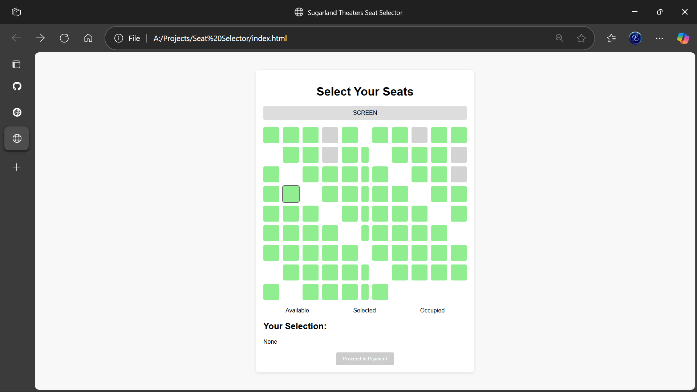
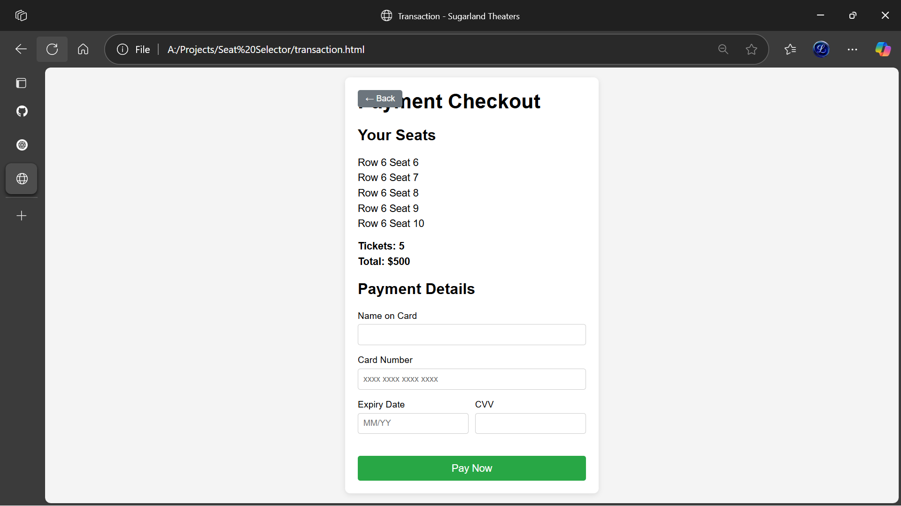

  <h1 align="center">🎟️ Seat Selector</h1>

<p align="center">
  <b>A sleek and responsive seat booking interface for theaters, events, and more!</b><br/>
  <i>Built with HTML, CSS, and JavaScript</i>
</p>

<p align="center">
  <a href="LICENSE"></a>
  
  
</p>

---

## 🖼️ Live Preview

👉 **[Try it Now](https://lakshaykaushik1.github.io/Seat-Selector/)**  
_See the Seat Selector in action — choose your seat like a VIP!_

---

## ✨ Features

✅ Smooth seat selection UI  
✅ Hover and click animations  
✅ Real-time booking visuals  
✅ Mobile-friendly and responsive layout  
✅ Persistent state using Local Storage (optional)  
✅ Clean, minimal interface with great UX

---

## 📸 Sneak Peek

<p align="center">
  
  &nbsp;&nbsp;
  
</p>

---

## 🧰 Tech Stack

<table>
  <thead>
    <tr>
      <th>Tech</th>
      <th>Description</th>
    </tr>
  </thead>
  <tbody>
    <tr>
      <td>🧱 HTML5</td>
      <td>Structure</td>
    </tr>
    <tr>
      <td>🎨 CSS3</td>
      <td>Styling and responsiveness</td>
    </tr>
    <tr>
      <td>⚙️ JavaScript</td>
      <td>Logic & Interactivity</td>
    </tr>
    <tr>
      <td>💾 LocalStorage</td>
      <td>(Optional) Save selected seats</td>
    </tr>
  </tbody>
</table>

---

## ⚙️ How to Run Locally

To run this project on your machine:

```bash
# 1. Clone the repository
git clone https://github.com/lakshaykaushik1/Seat-Selector.git

# 2. Navigate into the folder
cd Seat-Selector

# 3. Open index.html in your browser
#    You can also use a Live Server extension in VS Code
